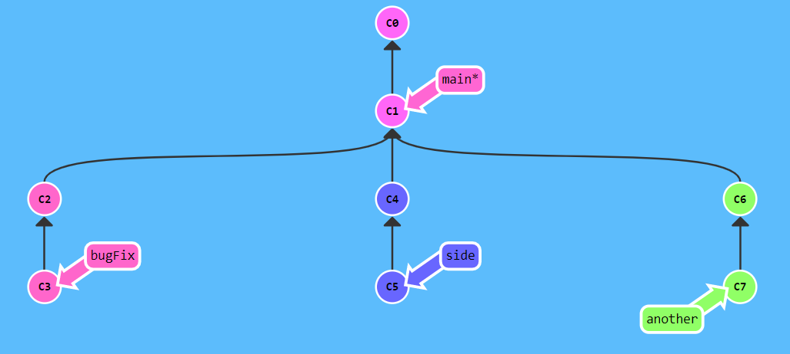

# git-Learning

### 初始化仓库并作出初次提交
1. git init 初始化一个仓库
2. git clone 远程仓库地址
3. git checkout -b master
4. git add . 
5. git commit -m '本次提交的备注'
6. git push origin master

### 拉取代码的时候
1. git stash 
2. git pull / git fetch + git merge
3. git stash pop
4. (解决冲突)
5. git add . + git commit + git push

### 合并分支(merge,rebase)
#### 当前有分支 master 和 分支 new

1. master merge new //在master分支上合并 , 产生一次新的commit记录
2. new rebase master //把new分支变基到master分支最新节点上面去 , 形成线性提交结构

### 改变HEAD指向的分支 ^/~
``master* : c1->c2->c3
new : c1->c4->c5``
1. git checkout c4 (HEAD -> c4,new -> c5,master -> c3)
2. git branch -f master HEAD^ (HEAD -> c4,new -> c5,master -> c2)
3. git branch  -f new HEAD~2 (HEAD -> c4,new -> c1,master -> c2)

### 回退操作 ( reset / revert )
``master* : c1->c2->c3
new : c1->c4->c5``
#### 当前分支master最新提交的c3中有错误要回退版本
1. git reset --hard c2 本地仓库回退到c2
2. git reset c2 目前还不清楚1和2的详细区别
3. git revert c3 master:c1->c2->c3->c3'
#### 当前分支new中c4有错误,但是要保留c5代码
1. git reset c4 错误,c5提交会被丢弃
2. git revert c4 new : c1->c4->c5->c4' c4'是c4->c5丢弃了c4之后再合并的返回结果
3. git rebase -i HEAD~2 //再在弹出窗口中删除c4即可

### cherry-pick 把蓝色图片里面的分支处理成红色图片里面的样子

由蓝图可知,当前Head处于master分支上面 , 要变成红图那样在master分支上面获取到另外三个分支上面的一些节点功能,这个时候cherry-pick就可以非常方便的处理这个需求
1. git cherry-pick c3 c4 c7  只用这一句就可以实现红图
