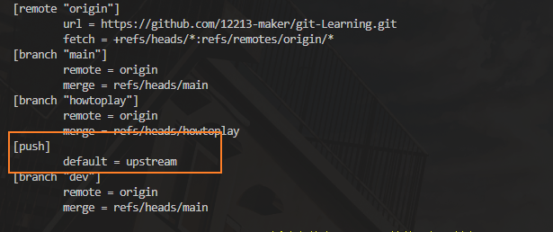

# git push 到底执行了什么？

git push 的完整指令是：
git push `远程服务器` `本地分支`：`远程分支`
（`git push origin master：master`）

### 当只使用git push的时候会根据push的默认值来做出不同的响应

#### push.default 有三种值：（upstream，current，simple） 默认的是simple

通过`git config push.default [upstream|current|simple]`来改变push.default的值
可以在config中查看push的值

+ simple:
  推送本地分支dev的时候：如果在远程仓库中找不到对应的dev分支就会`报错`

+ current:
  推送本地分支dev的时候：如果在远程仓库中找不到对应的dev分支就会在远程自动创建一个dev分支

+ upstream:
  找到上游分支,并且直接在远程中创建对应分支